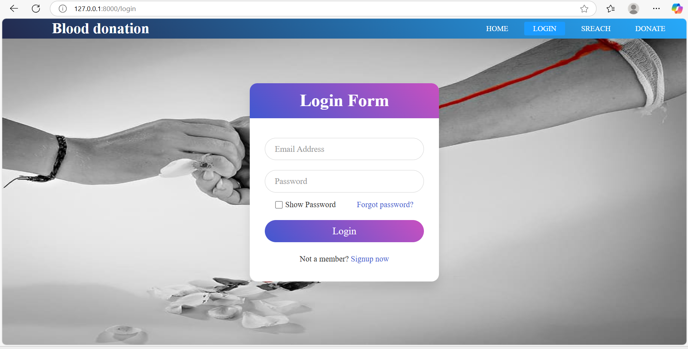
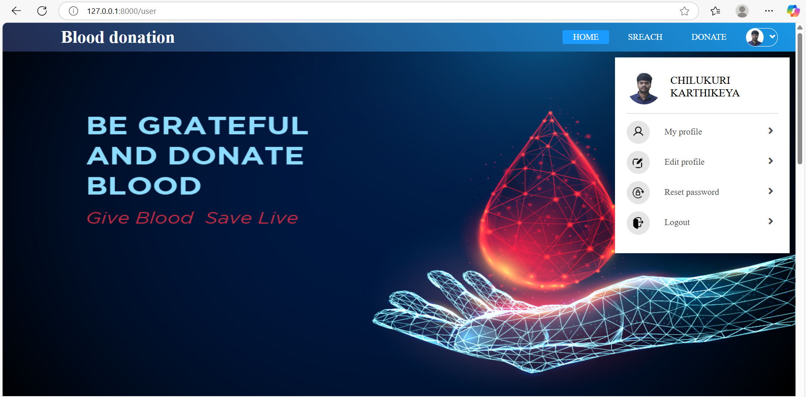
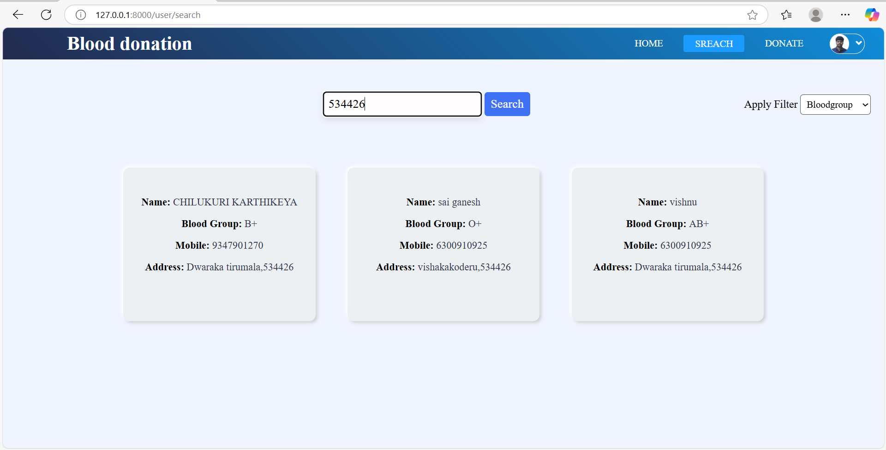

# 🩸 Blood Donation System

The **Blood Donation System** is a web-based platform that helps users find blood donors, manage donation records, and connect hospitals with available blood resources efficiently.

## 🚀 Features

- Donor registration and management
- Blood request with details
- Search for donors by blood group and location
- Email notifications 

## 🛠️ Built With

- **Frontend**: HTML, CSS, JavaScript
- **Backend**: Django
- **Database**: MongoDB

## 📸 Screenshots

### 🔐 Login Page


### 🩸 Home Page


### 🧾 Donors List


## 📦 Installation

```bash
# Clone the repository
git clone https://github.com/ChilukuriSivaKarthikeya/Blood_donation_System.git

# Navigate into the project directory
cd Blood_donation_System

# Install dependencies (make sure virtualenv is activated)
pip install -r requirements.txt

# Run migrations
python manage.py migrate

# Start the server
python manage.py runserver
